# Lab 1 : Création d'un cluster AKS via le portail Azure + visualisation des ressources via le portail Azure
Dans la console Azure :
1. "Create a resource"
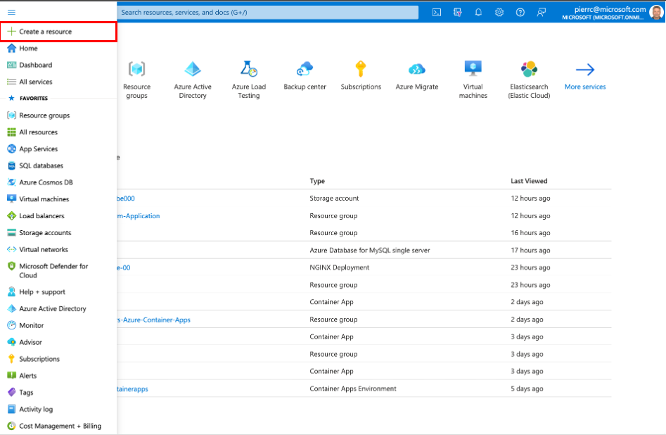
2. Aller dans "Containers" et cliquez dans "Create" (Kubernetes Service)
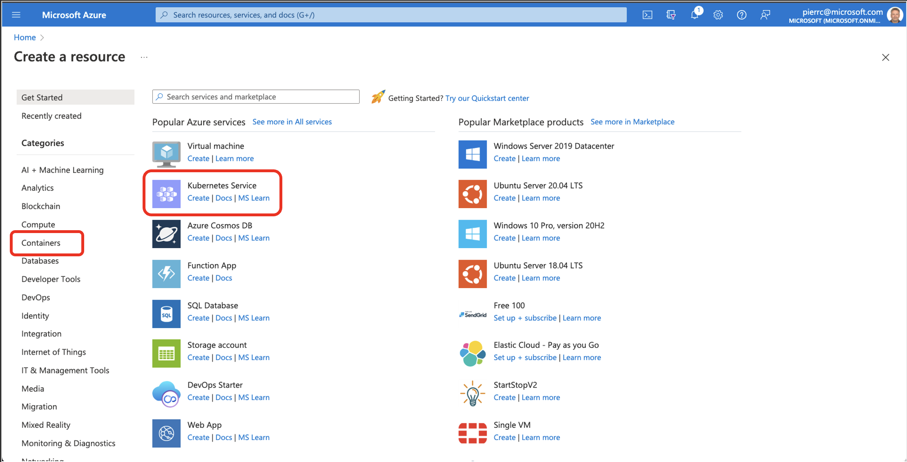
3.Paramétrage du Cluster
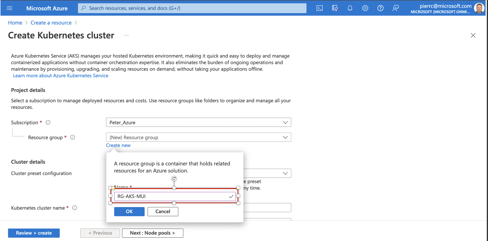
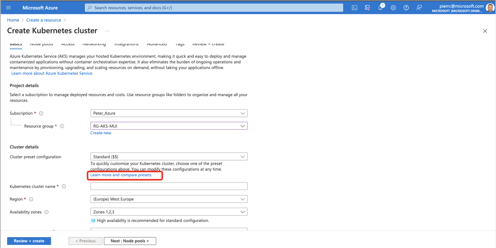
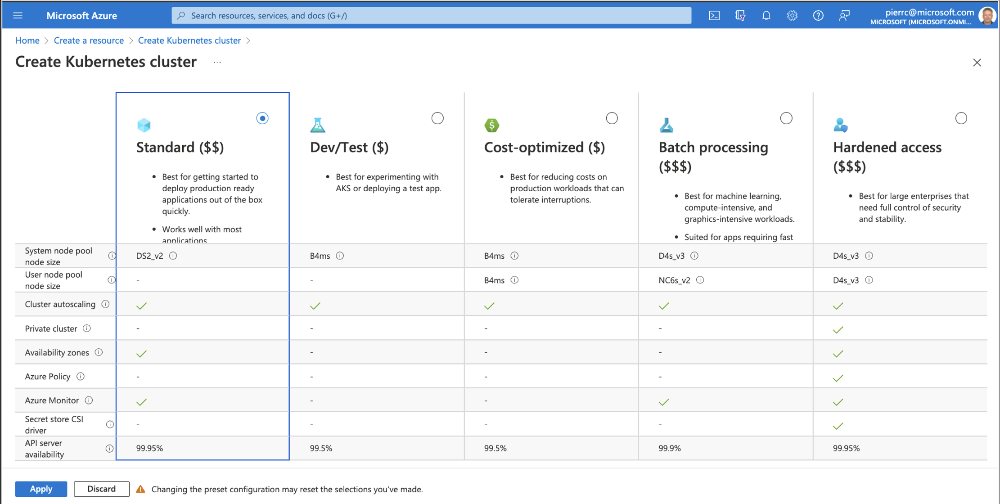
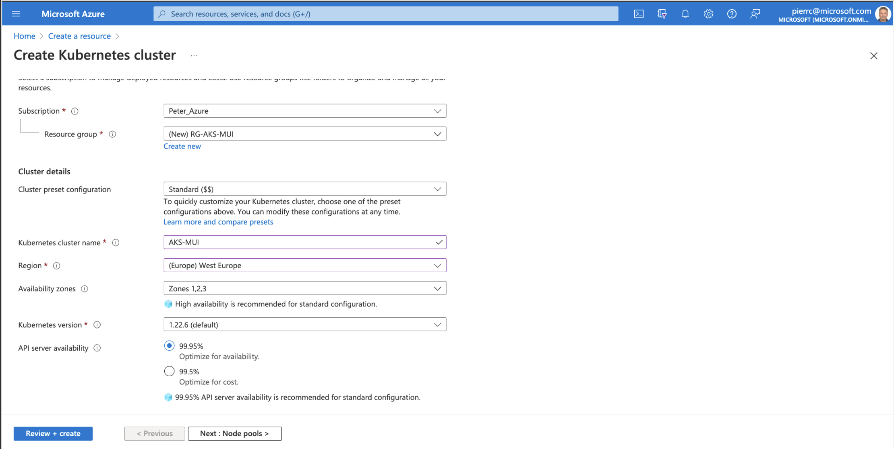
<a href="https://docs.microsoft.com/en-us/azure/aks/availability-zones#overview-of-availability-zones-for-aks-clusters">Information sur les "Avaibility zones"</a> 
<a href="https://github.com/kubernetes/kubernetes/blob/master/CHANGELOG/CHANGELOG-1.24.md">Changes Log</a> 
<a href="https://docs.microsoft.com/fr-fr/azure/aks/supported-kubernetes-versions?tabs=azure-cli">Versions de Kubernetes prises en charge dans Azure Kubernetes Service</a> 
<a href="https://docs.microsoft.com/en-us/azure/aks/uptime-sla">API server availability</a> 
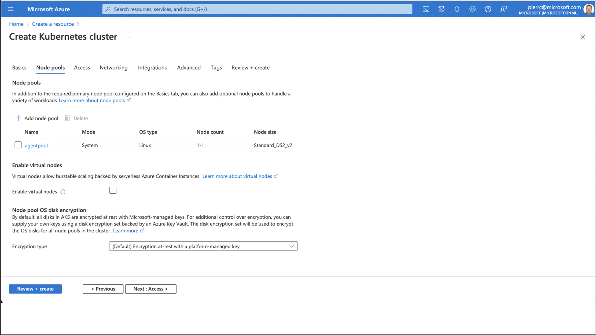
<a href="https://docs.microsoft.com/fr-fr/azure/aks/concepts-scale">Scale method</a>
<a href="https://docs.microsoft.com/en-us/azure/aks/use-multiple-node-pools">Create and manage multiple node pools for a cluster in Azure Kubernetes Service</a>
<a href="https://docs.microsoft.com/en-us/azure/aks/azure-disk-customer-managed-keys">Bring your own keys (BYOK) with Azure disks in Azure Kubernetes Service</a>
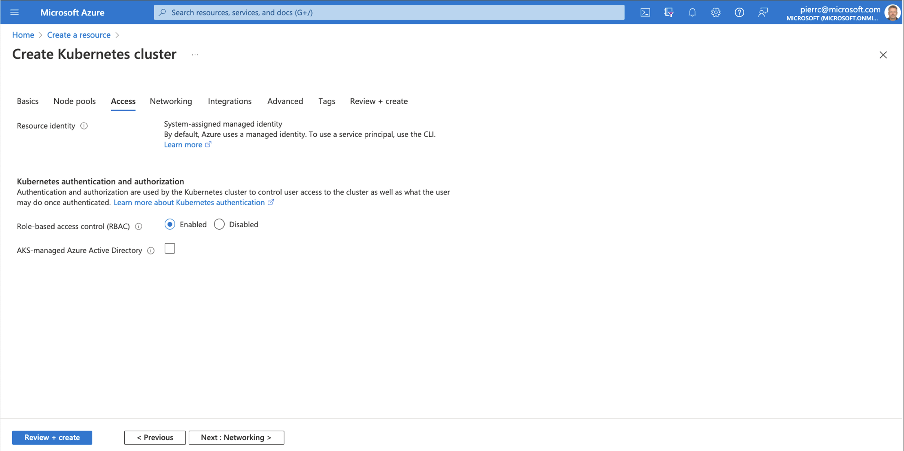
<a href="https://docs.microsoft.com/en-us/azure/aks/kubernetes-service-principal?tabs=azure-cli">Use a service principal with Azure Kubernetes Service</a>
<a href="https://docs.microsoft.com/en-us/azure/aks/use-managed-identity">Use a managed identity in Azure Kubernetes Service</a>
<a href="https://docs.microsoft.com/en-us/azure/aks/managed-aad">AKS-managed Azure Active Directory integration</a>
<a href="https://docs.microsoft.com/en-us/azure/aks/manage-azure-rbac">Use Azure RBAC for Kubernetes Authorization</a>
<a href="https://docs.microsoft.com/en-us/azure/aks/azure-ad-rbac">Control access to cluster resources using Kubernetes role-based access control and Azure Active Directory identities in Azure Kubernetes Service</a>
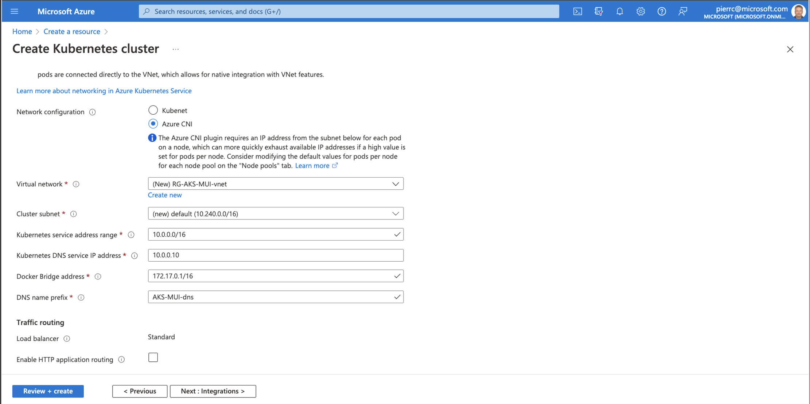
[Configure Azure CNI networking in Azure Kubernetes Service](https://docs.microsoft.com/en-us/azure/aks/configure-azure-cni)
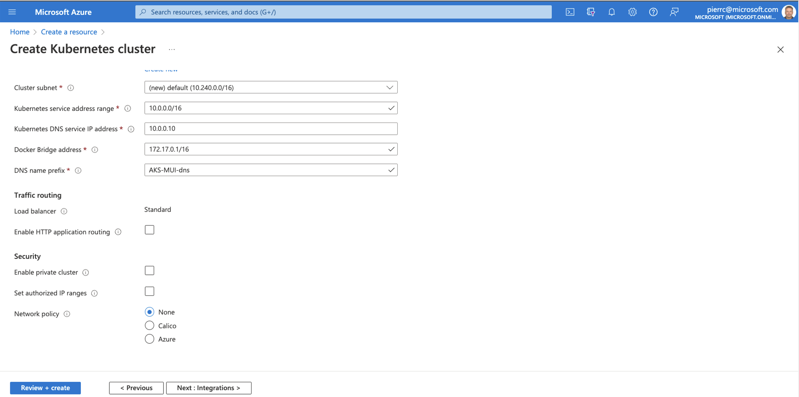
[Use a public Standard Load Balancer in Azure Kubernetes Service](https://docs.microsoft.com/en-us/azure/aks/load-balancer-standard)
[HTTP application routing](https://docs.microsoft.com/en-us/azure/aks/http-application-routing)
[Create a private Azure Kubernetes Service cluster](https://docs.microsoft.com/en-us/azure/aks/private-clusters)
[Secure access to the API server using authorized IP address ranges in Azure Kubernetes Service](https://docs.microsoft.com/en-us/azure/aks/api-server-authorized-ip-ranges)
[Secure traffic between pods using network policies in Azure Kubernetes Service](https://docs.microsoft.com/en-us/azure/aks/use-network-policies)
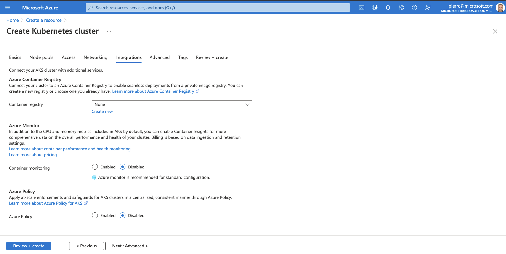
[Container insights overview](https://docs.microsoft.com/en-us/azure/azure-monitor/containers/container-insights-overview)
[Understand Azure Policy for Kubernetes clusters](https://docs.microsoft.com/en-us/azure/governance/policy/concepts/policy-for-kubernetes)
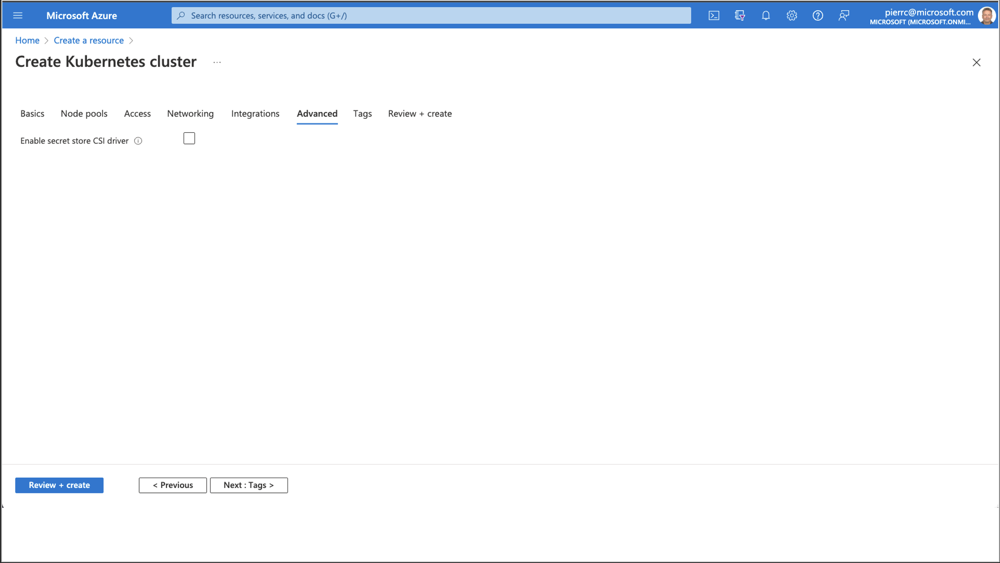
[Use the Azure Key Vault Provider for Secrets Store CSI Driver in an AKS cluster](https://docs.microsoft.com/en-us/azure/aks/csi-secrets-store-driver)
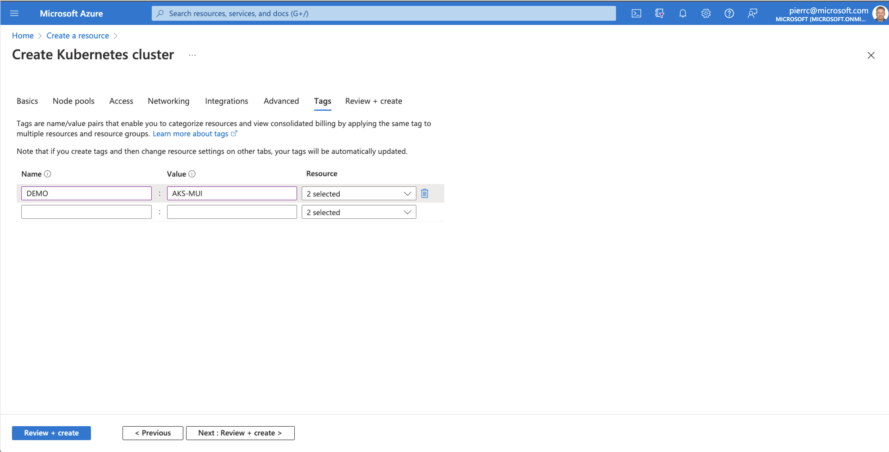
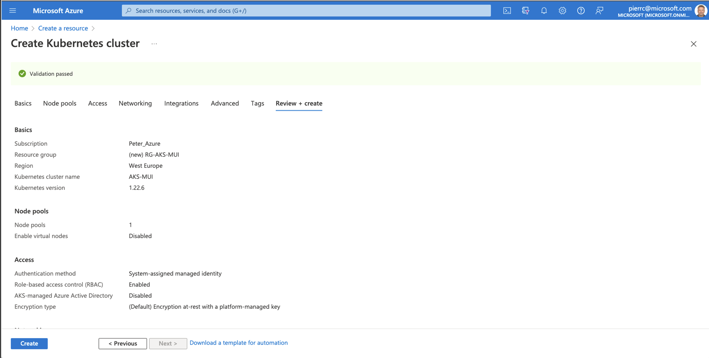
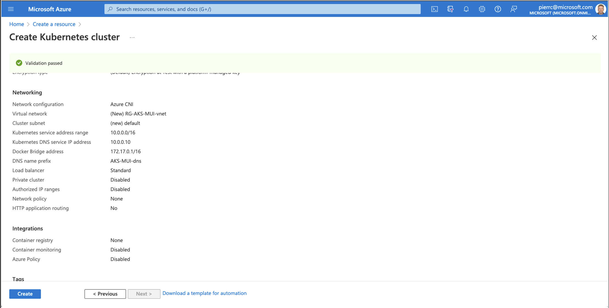
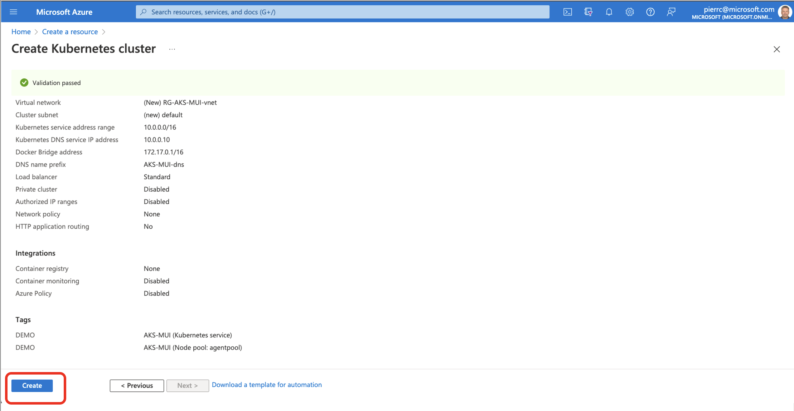

