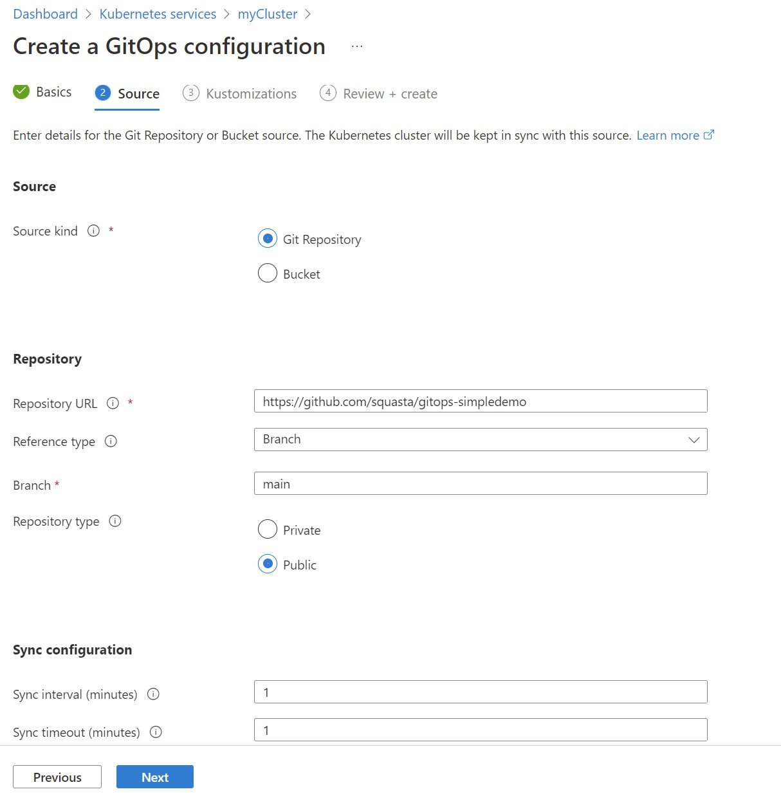
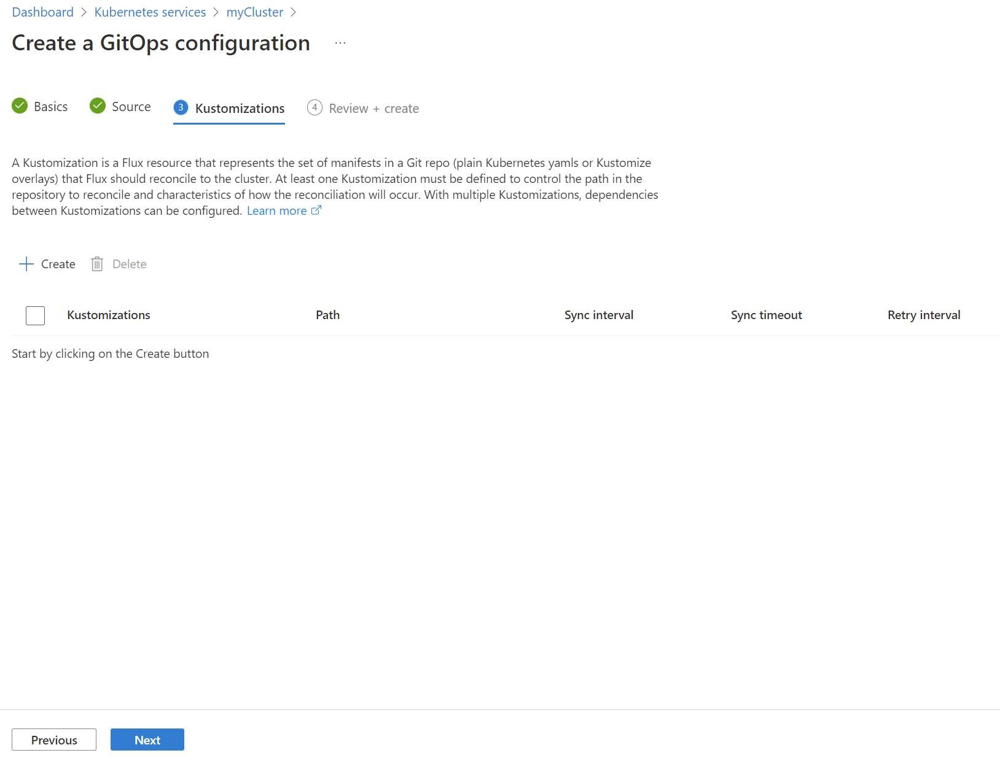
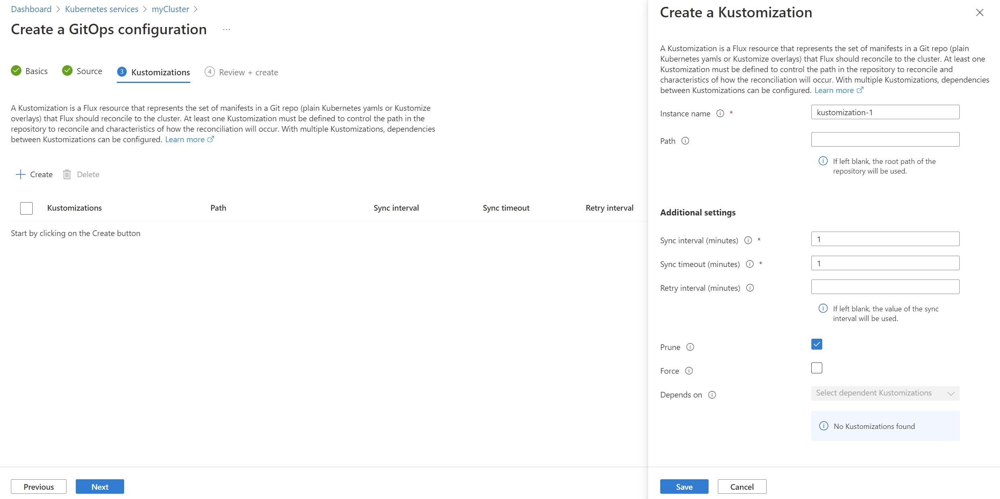
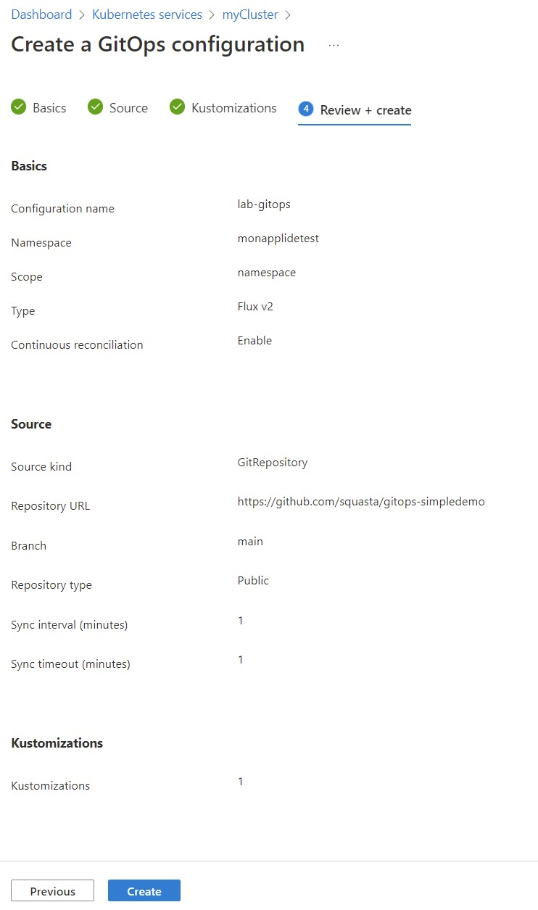
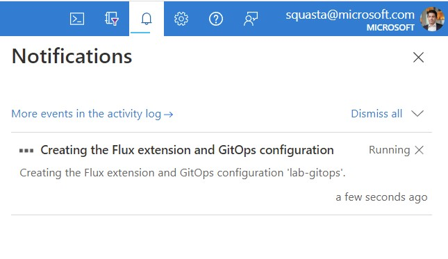
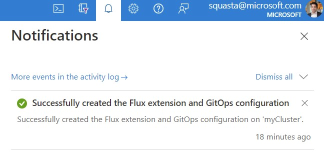

# Lab 12 - AKS et GitOps

## Objectifs
Faire des déploiements d'applications ou de configurations dans Kubernetes en utilisant l'extension GitOps d'Azure Kubernetes Service

Dans une approche GitOps, vous déclarez l’état souhaité de vos clusters Kubernetes dans des fichiers dans des référentiels Git. 

Les référentiels Git peuvent contenir les fichiers suivants :
-   Des [manifestes au format YAML](https://yaml.org/) qui décrivent les ressources Kubernetes (comme les namespaces, les secrets, les déploiements, etc.)
-   Des [charts Helm](https://helm.sh/docs/topics/charts/) pour le déploiement d’applications
-   Des [fichiers Kustomize](https://kustomize.io/) pour décrire les modifications spécifiques à l’environnement

Comme ces fichiers sont stockés dans un repo Git, ils sont versionnés et les modifications entre les versions sont facilement suivies. 

Des contrôleurs Kubernetes s’exécutent dans les clusters et réconcilient continuellement l’état du cluster avec l’état souhaité déclaré dans le référentiel Git.

l'extension GitOps pour AKS (et Azure Arc enabled Kubernetes) utilise Flux v2  https://fluxcd.io/docs/ et permet cet alignement entre la configuration souhaitée (déclarée dans le repo Git) et la configuration en cours sur le cluster Kubernetes


## Pré-requis sur le poste d'administration

-   Un abonnement Azure avec les privilèges d'administration (idéalement owner)
-   Azure CLI 2.37 or >: [https://docs.microsoft.com/en-us/cli/azure/install-azure-cli?view=azure-cli-latest](https://docs.microsoft.com/en-us/cli/azure/install-azure-cli?view=azure-cli-latest) 
-   kubectl

Les opérations sont réalisables depuis l'Azure Cloud Shell : [https://shell.azure.com](https://shell.azure.com/)

## Création d'un cluster AKS pour le lab

```bash
az login

az group create --name "RG-Lab12" --location "eastus2"

az aks create -n "myCluster" -g "RG-Lab12" --network-plugin azure --enable-managed-identity  --generate-ssh-keys 

az aks get-credentials -n "myCluster" -g "RG-Lab12"
```

## Installation de l'extension GitOps Flux v2

Activer la fonctionnalité Extension Manager dans le provider Microsoft.ContainerService

```bash
az feature register --namespace Microsoft.ContainerService --name AKS-ExtensionManager
```

L’extension `microsoft.flux` doit être installée dans le cluster avant qu’une ou plusieurs `fluxConfigurations` puisse être créées. L’extension sera installée automatiquement lorsque vous créez la première`Microsoft.KubernetesConfiguration/fluxConfigurations` dans un cluster.

Il est également possible d'installer manuellement l'extension via le portail, les API REST, un modèle ARM ou Azure CLI

Ajouter le support des extensions à la CLI Azure

```bash
az extension list -o table

az extension add --name k8s-extension
az extension add --name k8s-configuration

az extension list -o table
```

Pour mettre à jour des extensions d'Azure CLI

```bash
az extension update -n k8s-configuration 
az extension update -n k8s-extension

az extension list -o table
```


Lister les extensions installées dans le cluster AKS

```bash
az k8s-extension list --cluster-name "myCluster" --resource-group "RG-Lab12" --cluster-type managedClusters -o jsonc
```

le résultat est une liste vide.

cf. https://docs.microsoft.com/en-us/cli/azure/k8s-extension?view=azure-cli-latest

Il est possible d'ajouter l'extension GitOps (flux v2) au cluster AKS via la commande az k8s-extension create. 

Néanmoins le plus simple c'est de créer une première configuration GitOps et l'extension GitOps sera installée automatiquement.

## Créer une nouvelle configuration GitOps
Le but  ici est de définir un ensemble de paramètres pour automatiser les déploiements de ressources dans Kubernetes depuis des manifests YAML stocké dans un repo Git.

Dans votre compte GitHub, commencez par forker le repo suivant : https://github.com/squasta/gitops-simpledemo

Le reste des opérations liées au dépot Git sera fait sur votre repo https://github.com/VotreCompteGitHub/gitops-simpledemo

Le changement de code dans le repo Git sera pris en compte par l'extension GitOps qui appliquera l'état souhaité dans le cluster

Aller dans le portail Azure dans la partie services Kubernetes : https://portal.azure.com/#view/HubsExtension/BrowseResource/resourceType/Microsoft.ContainerService%2FmanagedClusters

Aller dans le cluster AKS créé en début de lab puis aller dans la partie Settings -> GitOps


Cliquer sur Create


Donner un nom à la configuration. 
- Exemple : lab-gitops

Donner un nom de namespace où seront créées les resources custom flux
- Exemple : labgitops

Mettre le scope sur Cluster

Cliquer sur Next



Sélectionner Source kind : Git Repository
- Un bucket est un espace de stockage pour artifacts (AWS S3, Azure, GCP, solutions compatibles API S3). cf. https://fluxcd.io/docs/components/source/buckets/

Dans Repository URL, mettre l'URL de votre repo (issue du fork de celui proposé)

Conserver les options par défaut :
Reference type : Branch
Branch : Main

Mettre Repository type à Public

Modifier la configuration de synchronisation à 1 minute (au lieu de 10)

Cliquer sur Next



Cliquer sur Create
Laisser les valeurs par défaut et modifier les Sync interval pour les mettre à 1 minute

Cocher Prune
- Cette option de flux permet la suppression des objets instanciés dans le cluster Kubernetes si les définitions de ces objets sont supprimées du repo. cf. https://fluxcd.io/docs/components/kustomize/kustomization/#garbage-collection



Cliquer sur Save


Cliquer sur Next



Cliquer sur Create



Cliquer sur Refresh



Attendre une ou deux minutes :)


Lister les extensions installées dans le cluster AKS

```bash
az k8s-extension list --cluster-name myCluster --resource-group "RG-Lab12" --cluster-type managedClusters -o table

az k8s-extension list --cluster-name myCluster --resource-group "RG-Lab12" --cluster-type managedClusters -o jsonc
```

L'extension de type __microsoft.flux__ est installée avec une version donnée (exemple 1.2.0)

Cette extension microsoft.flux a été installée dans le cluster Kubernetes dans le namespace flux-system

```bash
kubectl get namespaces
```

Le résultat doit être le suivant :

```bash
NAME                STATUS   AGE
default             Active   112m
flux-system         Active   48m
kube-node-lease     Active   112m
kube-public         Active   112m
kube-system         Active   112m
labgitops           Active   47m
monapplication      Active   47m
```

Un namespace flux-system est désormais présent. 

```bash 
kubectl get pods -n flux-system
```

Il contient les composants flux.

```bash
NAME                                       READY   STATUS    RESTARTS   AGE
fluxconfig-agent-6476794446-smpw8          2/2     Running   0          51m
fluxconfig-controller-856d755dc9-6p764     2/2     Running   0          51m
helm-controller-649dbbb9cb-dwhch           1/1     Running   0          51m
kustomize-controller-6485647d5d-2v2l4      1/1     Running   0          51m
notification-controller-54d46947f5-vhwvf   1/1     Running   0          51m
source-controller-696bbfc9f8-x5mf4         1/1     Running   0          51m
```

Plus d'informations sur ces différents composants : https://docs.microsoft.com/en-us/azure/azure-arc/kubernetes/conceptual-gitops-flux2#:~:text=The%20microsoft.flux%20extension%20installs%20by%20default%20the%20Flux%20controllers

Les objets Kubernetes décrits dans le repo ont été créés dans le namespace monapplication

```bash
kubectl get pods --all-namespaces -o wide
```

Les configuration  Flux (GitOps) peuvent être gérées / créée via Azure CLI

cf. https://docs.microsoft.com/en-us/cli/azure/k8s-configuration/flux?view=azure-cli-latest

```bash
az k8s-configuration flux list --cluster-name myCluster --cluster-type managedClusters --resource-group "RG-Lab12" -o table
```

le résultat doit ressembler à ça:

```bash
Namespace    Name        Scope    ProvisioningState    ComplianceState    StatusUpdatedAt                   SourceUpdatedAt
-----------  ----------  -------  -------------------  -----------------  --------------------------------  -------------------------
labgitops    lab-gitops  cluster  Succeeded            Compliant          2022-06-30T12:00:13.527000+00:00  2022-06-30T11:42:31+00:00
```

Pour avoir un résultat détaillé

```bash
az k8s-configuration flux list --cluster-name "myCluster" --cluster-type managedClusters --resource-group "RG-Lab12" -o jsonc
```

## Modifier le code dans le repo

Créer et commiter un nouveau manifest monnamespace.yaml dans le repo utilisé dans la configuration GitOps pour créer un objet Kubernetes simple (un namespace)

```yaml
apiVersion: v1
kind: Namespace
metadata:
  name: <insert-namespace-name-here>
```

Vérifier après 1 ou 2 minutes la création de ce nouveau namespace dans le cluster

```bash
kubectl get namespaces
```

Supprimer le manifest (ou changer le nom du namespace et commiter).

Vérifier après 1 ou 2 minutes la suppression ou modification du  namespace dans le cluster

```bash
kubectl get namespaces
```

## Nettoyage 

```bash
az group delete -n "RG-Lab12"
```
