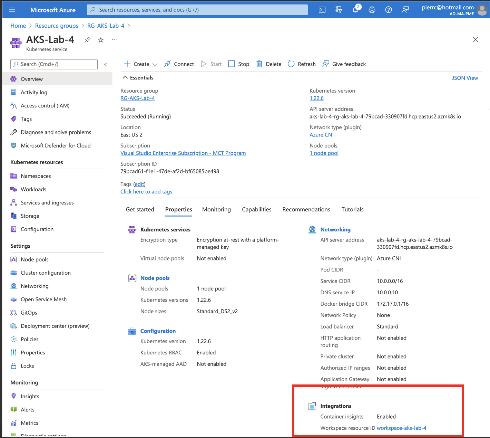
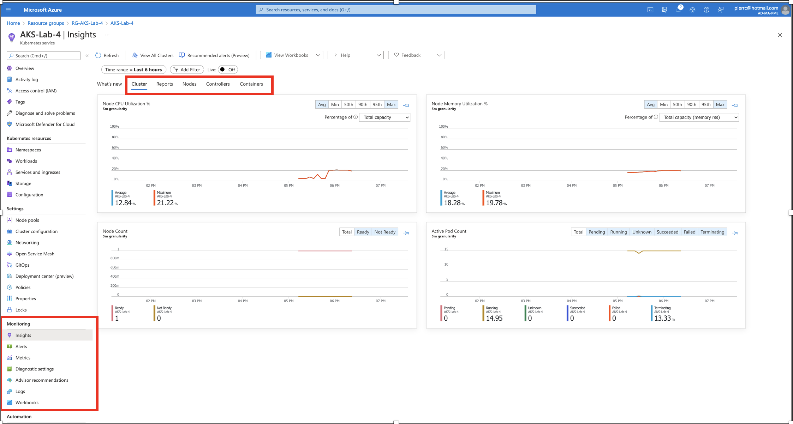
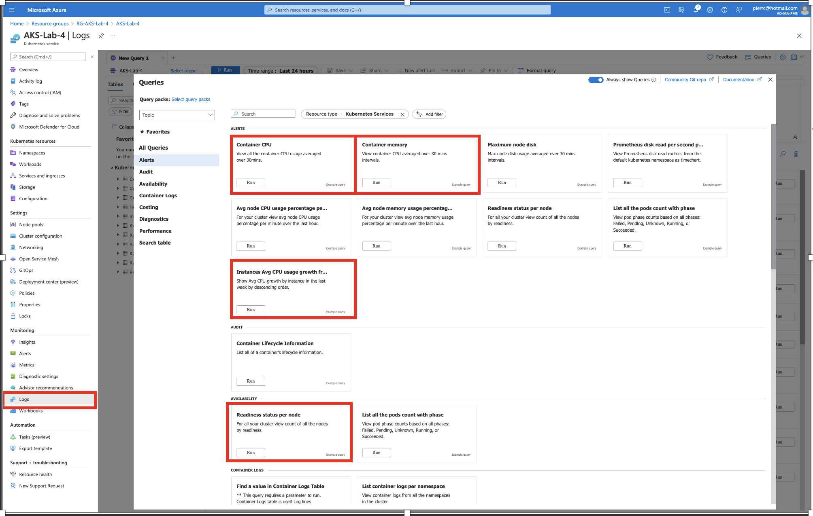

# Lab 4 : Activation du monitoring avec Azure Monitor
## Objectif:
Savoir utiliser Azure Monitor pour surveiller l’intégrité et les performances d’Azure Kubernetes Service (AKS). Cela comprend :<br>
- la collecte des données de télémétrie critiques pour la surveillance <br>
- l’analyse et la visualisation des données collectées pour identifier les tendances <br>
- configurer des alertes pour être informé de manière proactive des problèmes critiques <br>

1. **Création de l'environnement de démonstration** <br>
**_Déploiement du "resource group":_**
```
az group create \
    --location "eastus2" \
    --resource-group "RG-AKS-Lab-4"
```
**_Déploiement d'un virtual network:_**
```
az network vnet create \
    --resource-group "RG-AKS-Lab-4" \
    --name AKSvnet \
    --location "eastus2" \
    --address-prefixes 10.0.0.0/8
```
**_Déploiement du subnet_:**
```
SUBNET_ID=$(az network vnet subnet create \
    --resource-group "RG-AKS-Lab-4" \
    --vnet-name AKSvnet \
    --name subnetAKS \
    --address-prefixes 10.240.0.0/16 \
    --query id \
    --output tsv)
```
**_Création d'une "Managed Identity":_**
```
IDENTITY_ID=$(az identity create \
    --resource-group "RG-AKS-Lab-4" \
    --name idAks \
    --location "eastus2" \
    --query id \
    --output tsv)
```
**_Création du "cluster AKS":_**
```
az aks create \
    --resource-group "RG-AKS-Lab-4" \
    --name "AKS-Lab-4" \
    --location "eastus2" \
    --network-plugin azure \
    --generate-ssh-keys \
    --node-count 2 \
    --enable-cluster-autoscaler \
    --min-count 1 \
    --max-count 3 \
    --vnet-subnet-id $SUBNET_ID \
    --enable-managed-identity \
    --assign-identity $IDENTITY_ID \
    --yes
```

Pour l'instant le monitoring n'est pas activé !<br>

**_Installez l'application azure-vote:_** <br>
Comme dans le Lab_1 à l'aide de la console Azure :<br>
-> Dans la ressource du cluster AKS
-> Get started
-> Create
-> Create a basic web application
-> Deploy
-> Attendre le deploiement
-> Close
-> Keep

2. **Activation du monitoring**<br>
**_Création d'un "Log Analytics workspace":_**
```
AKS_MONITORING_LOG_ANALYTICS_WORKSPACE_ID=$(
   az monitor log-analytics workspace create \
      --resource-group "RG-AKS-Lab-4"  \
      --workspace-name "Workspace-AKS-Lab-4" \
      --location "eastus2" \
      --query id \
      -o tsv
)
```
**_Activation du monitoring du cluster AKS avec le "Log Analytics workspace":_**
```
az aks enable-addons \
   --addons monitoring \
   --name "AKS-Lab-4" \
   --resource-group "RG-AKS-Lab-4" \
   --workspace-resource-id $AKS_MONITORING_LOG_ANALYTICS_WORKSPACE_ID
```

3. **Monitoring**
- Les Insights

Naviguez dans :<br>
-> Reports -> Node Monitoring -> Disk Capacity <br>
-> Nodes -> aks-nodepool1-xxxxxxxx-vmssxxxxxx -> selectionnez azure-vote-front-xxxxxxxxxxx -> azure-vote-front -> Live Logs (azure-vote -> allez sur le site azure-vote dans votre navigateur pour voir des Live Logs) <br>
-> Controllers -> azure-vote-front-xxxxxxxxx (replicaSet) <br>
-> Containers <br><br>

- Exemple de requetes "Kusto" : <br>

Lancer les quatre requêtes "Kusto" <br><br>
- Les alerts


