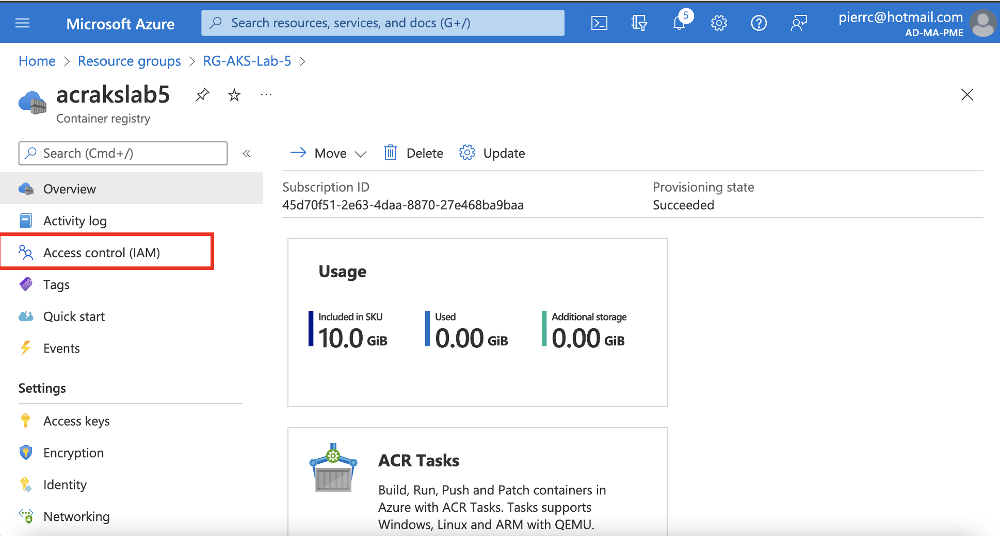
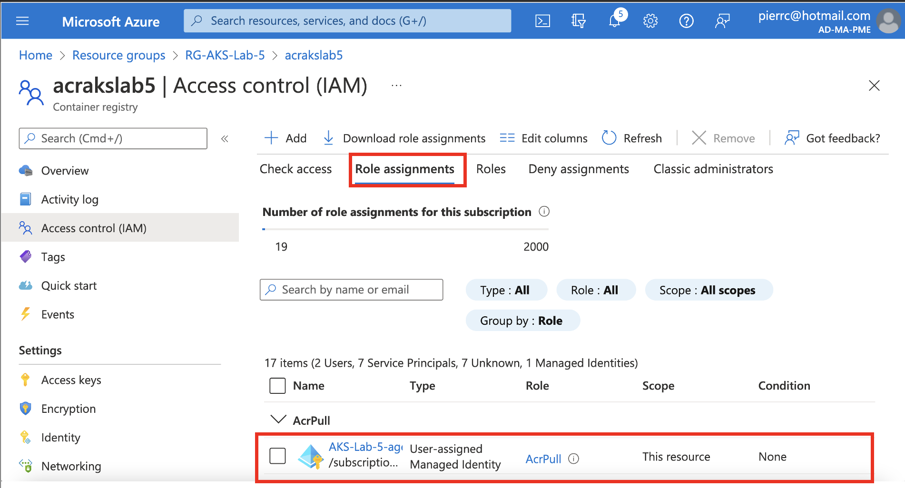
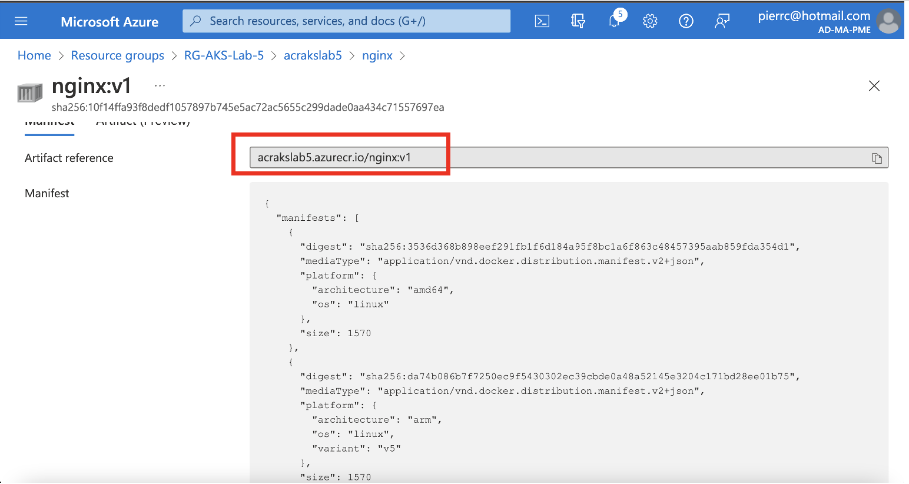

# Lab 5 : Azure Container Registry : configuration, importation et utilisation avec AKS
## Objectif:<br>
Quand vous utilisez Azure Container Registry (ACR) avec Azure Kubernetes Service (AKS), vous avez besoin d’un mécanisme d’authentification et d'authorisation pour que les noeuds du cluster AKS puissent se connecter à l'ACR pour faire un pull des images de conteneurs. L'objectif de ce lab, c'est d'implémenter via l’outil en ligne de commande Azure CLI  les autorisations requises à votre Azure Container Registry.<br>

1. **Création de l'environnement de démonstration** <br>
**_Déploiement du "resource group":_**
```
az group create \
    --location "eastus2" \
    --resource-group "RG-AKS-Lab-5"
```
**_Déploiement d'un virtual network:_**
```
az network vnet create \
    --resource-group "RG-AKS-Lab-5" \
    --name AKSvnet \
    --location "eastus2" \
    --address-prefixes 10.0.0.0/8
```
**_Déploiement du subnet_:**
```
SUBNET_ID=$(az network vnet subnet create \
    --resource-group "RG-AKS-Lab-5" \
    --vnet-name AKSvnet \
    --name subnetAKS \
    --address-prefixes 10.240.0.0/16 \
    --query id \
    --output tsv)
```
**_Création d'une "Managed Identity":_**
```
IDENTITY_ID=$(az identity create \
    --resource-group "RG-AKS-Lab-5" \
    --name idAks \
    --location "eastus2" \
    --query id \
    --output tsv)
```
**_Création du "cluster AKS":_**
```
az aks create \
    --resource-group "RG-AKS-Lab-5" \
    --name "AKS-Lab-5" \
    --location "eastus2" \
    --network-plugin azure \
    --generate-ssh-keys \
    --node-count 2 \
    --enable-cluster-autoscaler \
    --min-count 1 \
    --max-count 3 \
    --vnet-subnet-id $SUBNET_ID \
    --enable-managed-identity \
    --assign-identity $IDENTITY_ID \
    --yes
```
Dans ce scénario on intègre une Azure Container Registry avec un cluster AKS déjà déployé. Cela aurait pu être fait lors de la création du cluster<br>
2. **_Création de l'"Azure Container Registry":_**
```
az acr create \
  --name "acrakslab5" \
  --resource-group "RG-AKS-Lab-5" \
  --sku basic
```
**_Intégration du cluster AKS à l'"Azure Container Registry":_**
```
az aks update \
   --name "AKS-Lab-5" \
   --resource-group "RG-AKS-Lab-5" \
   --attach-acr "acrakslab5"
```
Allez dans l'Azure Container Registry créée : <br>

<br>
On constate que le pool agent à le rôle "ACRPull" pour venir récupérer des images dans l'Azure Container Registry<br>

3. **_Importer une image dans votre instance ACR_**
```
az acr import \
  --name "acrakslab5" \
  --source docker.io/library/nginx:latest \
  --image nginx:v1
```
<br>
<br>

4. **_Déployer l’exemple d’image depuis ACR vers AKS_**
**Identification**<br>
```
az aks get-credentials \
  --resource-group "RG-AKS-Lab-5" \
  --name "AKS-Lab-5"
```

Créez un fichier "acr-nginx.yml" (ex: `touch acr-ngnix.yml`)<br>
Copiez le contenu du fichier ci-dessous (vi ou nano ...)<br>
```
---
apiVersion: v1
kind: Namespace
metadata:
   name: nginx0namespace
spec:
  finalizers:
    - kubernetes
---    
apiVersion: apps/v1
kind: Deployment
metadata:
  name: nginx0-deployment
  namespace: nginx0namespace
  labels:
    app: nginx0-deployment
spec:
  replicas: 1
  selector:
    matchLabels:
      app: nginx0
  template:
    metadata:
      labels:
        app: nginx0
    spec:
      containers:
      - name: nginx
        image: acrakslab5.azurecr.io/nginx:v1
        ports:
        - containerPort: 80
---
apiVersion: v1
kind: Service
metadata:
  name: nginx0-service
  namespace: nginx0namespace
spec:
  type: LoadBalancer
  ports:
  - port: 80
  selector:
    app: nginx0
```
Exécutez ce déploiement dans votre cluster AKS <br>
`kubectl apply -f ./acr-nginx.yml`<br>
Tests du déploiement: <br>
`kubectl get pods --namespace=nginx0namespace`<br>
`kubectl get service --namespace=nginx0namespace`<br>
`curl http://<EXTERNAL-IP>`<br>

4. **_Fin du Lab 5_**
```
az group delete \
   --name "RG-AKS-Lab-5" \
   --yes
```
