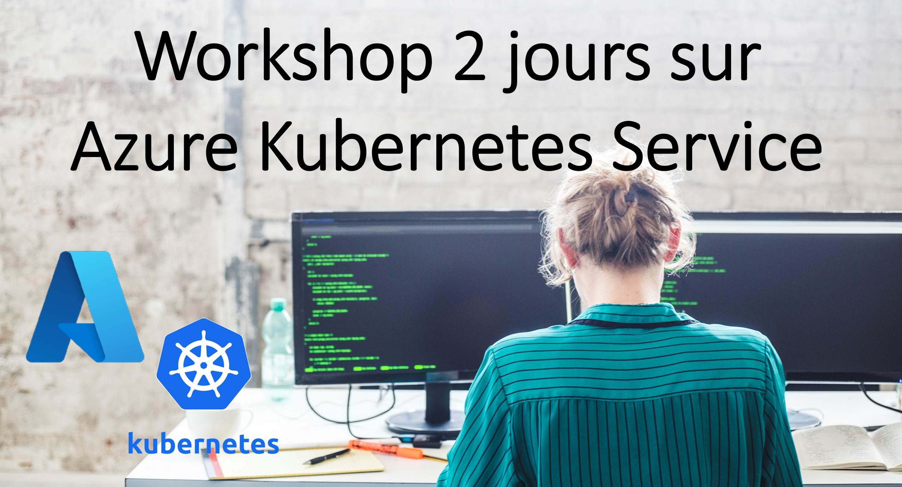

# Workshop-Azure-Kubernetes-Service-2days
Workshop de 2 jours autour de d'Azure Kubernetes Services et services associés

tags: #workshop #aks #github #kubernetes

 


## Objectifs
Découverte de Kubernetes dans Azure avec des exercices pratiques

## Agenda
### Jour 1
#### Matinée
- Introduction de l'atelier, programme des 2 journées
- Rappels rapides sur les architectures cloud natives, 12 factors apps, pet vs cattle, baking vs frying....
- Rappels rapides sur les basiques de Kubernetes
- Présentation AKS : control plane, worker nodes, réseau, stockage
- [Lab 1](/Lab_1/README.md) : création d'un cluster AKS via le portail Azure + visualisation des ressources via le portail Azure 
- [Lab 2](/Lab_2/README.md) : création d'un cluster plus avancé via Azure CLI, connexion et utilisation basique de kubectl
- [Lab 3](/Lab_3/README.md) : création d'un cluster avec plusieurs node pools avec autoscaling via Terraform + déploiement basique d'une application (service de type load balancer)
#### Après midi
- Intégration avec d'autres services Azure : Azure Monitor, Azure Policy, Azure Container Registry, Azure Log Anaytics, Azure Application Gateway, Azure NAT Gateway, Microsoft Defender for Cloud...
- [Lab 4](/Lab_4/README.md): Activation du monitoring avec Azure Monitor
- [Lab 5](/Lab_5/README.md) : Azure Container Registry : configuration, importation et utilisation avec AKS 
- [Lab 6](/Lab_6/README.md) : Installation d'AGIC, déploiement d'Azure Application Gateway et déploiement d'une application basique
- [Lab 7](/Lab_7/README.md) : Utilisation du Secret Store CSI Driver avec Azure Key Vault


### Jour 2
#### Matinée
- Gestion des montées de version : du cluster à l'application 
- [Lab 8](/Lab_8/README.md) : Montées de versions dans AKS
- [Lab 9](/Lab_9/README.md) : Montées de version de l'application  => Rolling update, Blue Green, Canary
- Automatisation des déploiements applicatifs et configurations Kubernetes : Deployment Center, Pipelines avec GitHub, GitOps
- [Lab 10](/Lab_10/README.md) : Pipeline basique CI/CD Kubernetes YAML 
#### Après midi
- Introduction à Kustomize
- [Lab 11](/Lab_11/README.md) : Introduction à Kustomize et Pipeline avec Kustomize
- [Lab 12](/Lab_12/README.md) : GitOps avec AKS et Fluxv2 
- Autoscaling quelles options ? HPA, KEDA, VPA, Virtual Kubelet...
- Conclusion - Tour de table

## Pré requis - compétences
- Connaissances basiques de Kubernetes : à minima regarder les vidéos suivantes : https://www.youtube.com/watch?v=Srsabd1J-KU et https://www.youtube.com/watch?v=we7prqhRRHA
- Connaissances basiques d'Azure (RG, Azure CLI, RBAC, Service Principal)
- Connaissances basiques de git
- Connaissance basiques Bash

## Pré requis - techniques
- Un Abonnement Azure avec des privilèges d'administrateur
- Un compte GitHub


## L'ensemble des labs peut être réalisé depuis l'Azure Cloud Shell

Accéder au cloud shell via l'url suivante dans votre navigateur : https://shell.azure.com

Ouvrir un Azure Cloud Shell. Si c'est la première utilisation d'Azure Cloud Shell, valider la création d'un compte de stockage (qui contiendra les données du profil).

Informations complémentaires sur Azure Cloud Shell : https://docs.microsoft.com/en-us/azure/cloud-shell/overview 


## Installation des composants nécessaires pour travailler sur un poste local (Optionnel)

### Avoir un environnement Bash 
- Pour ceux sous Windows 10/11 : Installation WSL2 https://docs.microsoft.com/en-us/windows/wsl/install

### Avoir les outils suivants installés dans WSL : 
- git -> https://git-scm.com/book/en/v2/Getting-Started-Installing-Git 
- Azure CLI -> https://docs.microsoft.com/fr-fr/cli/azure/install-azure-cli-linux?pivots=apt (test: ~$  az Login)
- terraform -> https://learn.hashicorp.com/tutorials/terraform/install-cli (test : ~$ terraform)

Procédure d'installation de la CLI Terraform pour Linux (WSL Ubuntu 20.04)
```
sudo apt-get update && sudo apt-get install -y gnupg software-properties-common curl
curl -fsSL https://apt.releases.hashicorp.com/gpg | sudo apt-key add -
sudo apt-add-repository "deb [arch=amd64] https://apt.releases.hashicorp.com $(lsb_release -cs) main"
sudo apt-get update && sudo apt-get install terraform
```

- kubectl -> https://kubernetes.io/docs/tasks/tools/#kubectl  (test: ~$  kubectl version)
- Visual Studio Code -> https://code.visualstudio.com
- Extension Terraform pour VSCode -> Depuis le bash, exécuter « code . » et aller chercher l’extension « Hashicorp Terraform »
- Extension WSL pour VSCode -> https://code.visualstudio.com/docs/remote/wsl-tutorial
- Extension YAML pour VSCode -> https://marketplace.visualstudio.com/items?itemName=redhat.vscode-yaml

## Créer une clé SSH si vous n'en avez pas déjà 

se placer sur le répertoire home : cd

ssh-keygen -t rsa 


## Créer un Service Principal dans Azure

az login

az account list -o table

Récupérer l'ID de la subscription Azure puis exécuter la commande suivante :

az ad sp create-for-rbac --name "votrenom-demo-githubaction2022" --role "Contributor" --scopes /subscriptions/METTRE_ICI_L_ID_DE_LA_SUBSCRIPTION -o jsonc

Récupérer le output de la commande et le sauvegarder temporairement dans un fichier 
